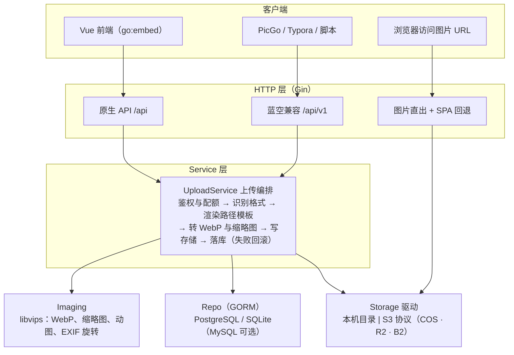

# ImgNest 图床管理系统：计划书与开发规范

> 版本：2026-10-04 · 作者：Shell · 在线版本：https://claude.ai/code/artifact/a63820dd-642d-4916-bdd0-706cdfbd1fd8

## 1. 项目概述

用 Go + Vue3 自研一个替代蓝空图床（Lsky Pro）社区版的图床管理程序，核心卖点是「多用户 × 多存储 × 多规则」和「原图 + WebP 双版本」，并兼容蓝空 v1 API，让 PicGo / Typora 等现有客户端零成本迁移。

**目标**

- 单二进制部署：前端打包后 `go:embed` 进 Go 程序，Docker 一条命令启动
- 存储可插拔：本机、腾讯云 COS、Cloudflare R2、Backblaze B2（后三者统一走 S3 协议）；一个存储对应一个访问域名
- 路径规则可配置：`{Y}/{m}/{d}/{filename}`、`{y}/{m}/{filename}` 等任意组合，支持随机打散
- WebP 一等公民：上传时同时生成 WebP，访问 `domain/yy/mm/name.webp` 或 `domain/yy/mm/name.原后缀`
- 缩略图两份：本地一份供后台秒开、不耗云端流量；云端一份 `name_thumbs.webp` 供外部调用
- EXIF 完整留存在本地数据库（含 GPS）；云端文件抹除 GPS 等敏感信息
- 删除走回收站：立即不可访问、可恢复、到期物理清理
- API 完整：原生 REST API + 蓝空 v1 兼容 API
- 相册管理 + 可开关的公开画廊
- 从蓝空一键迁移用户、相册、图片记录；现有图片在 B2，原位接管不搬文件，旧链接不变

**非目标（v1 不做）**

- 图片编辑器、水印设计器（后续可加文字/图片水印规则）
- 付费套餐、计费系统
- 内容审核对接（预留 hook，v2 再做）
- 视频、任意文件托管

## 2. 功能需求

P0 = 首个可用版本必须有；P1 = 紧接着做；P2 = 看心情。

| 模块 | 功能点 | 优先级 |
| --- | --- | --- |
| 用户 | 注册/登录、改密、容量统计；管理员/普通用户两类角色；可关闭注册 | P0 |
| 用户组 | 组内配置：总容量、单文件上限、允许后缀、可用存储规则、默认规则、上传频率 | P0 |
| 存储 | 本机 / S3 兼容（COS、R2、B2 预设模板）；一个存储配一个访问域名；「测试连接」按钮 | P0 |
| 存储规则 | 绑定一个存储；路径模板 + 文件名模板；WebP 模式；质量；最大尺寸；缩略图；云端隐私清理；链接优先返回哪个版本 | P0 |
| 上传 | 拖拽 / 粘贴 / 多选批量；进度条；选规则、选相册、公开/私有；结果一键复制 URL/Markdown/HTML/BBCode，原图与 WebP 切换 | P0 |
| WebP | 原图+WebP / 仅 WebP / 不转换三种模式；GIF 动图转动态 WebP；自动纠正 EXIF 方向 | P0 |
| 缩略图 | 本地一份（后台列表、预览用）+ 云端一份 `{文件名}_thumbs.webp`（API `thumbnail_url`、画廊用） | P0 |
| EXIF | 完整 EXIF 存本地数据库（含 GPS）；云端原图无损抹除 GPS/序列号/作者；详情页展示相机参数，GPS 仅本人和管理员可见 | P0 |
| 图片管理 | 网格浏览、搜索、按相册筛选、批量删除/移动/改权限；管理员可看全站图片 | P0 |
| 回收站 | 删除即不可访问，默认保留 7 天可恢复，到期物理删除；可「彻底删除」 | P0 |
| API Token | 用户自助创建/吊销；可设过期时间；最后使用时间 | P0 |
| 蓝空 v1 API | upload / images / albums / strategies / profile / tokens，字段对齐 | P0 |
| 蓝空迁移 | （延后，v1 不做）CLI 读蓝空数据库，导入用户（保留 bcrypt 密码）、相册、图片记录；B2 上的原图原位接管，不搬文件 | P1 |
| 存量补处理 | 后台任务对历史图片：补 WebP、补本地+云端缩略图、提取 EXIF；可选「清理历史原图 GPS」；可暂停、可续跑、限速 | P1 |
| 相册 | 增删改、封面、公开/私有、图片数 | P1 |
| 公开画廊 | 瀑布流展示公开图片；后台开关；可只展示公开相册 | P1 |
| 游客上传 | 开关 + 游客组限额 + IP 限流 | P1 |
| 自动 WebP 协商 | 本机存储时，访问 `.jpg` 且浏览器 `Accept` 含 `image/webp` 则直接返回 WebP | P2 |
| 水印 / 审核 hook / AVIF | 规则级水印、审核 Webhook、AVIF 输出 | P2 |

## 3. 技术架构与选型

单体应用、分层清晰：HTTP 层只做参数与鉴权，Service 层编排上传流程，Storage 与 Imaging 都是接口，可独立替换和测试。



注：S3 类存储的图片由桶 / CDN 域名直接访问，不经过本程序；本机存储由「图片直出」输出。

自己的前端和 PicGo 等客户端走不同入口，但都落到同一个 UploadService，保证规则、WebP、容量逻辑只有一份。

| 层 | 选型 | 理由 |
| --- | --- | --- |
| 语言 | Go ≥ 1.24（vipsgen 要求），跟随最新稳定版 | 单二进制、并发上传友好 |
| Web 框架 | Gin | 生态成熟、中文资料多；中间件做鉴权/限流/日志 |
| 数据库 | GORM；**主力 PostgreSQL + SQLite**，MySQL 驱动可选但不作为主测试目标 | 个人用 SQLite 零运维；多用户/高并发切 PostgreSQL；EXIF 用 PG 的 JSONB 可索引 |
| 图片处理 | libvips + [vipsgen](https://github.com/cshum/vipsgen) | 速度快、内存低、支持动图 WebP、自动旋转；绑定自动生成、覆盖全（见 3.1） |
| EXIF 读取 | [imagemeta](https://github.com/evanoberholster/imagemeta) | 纯 Go，支持 JPEG/PNG/TIFF/HEIC/AVIF 及主流 RAW；2026 年仍在维护 |
| 对象存储 | aws-sdk-go-v2 (S3) | COS / R2 / B2 都兼容 S3，一套驱动搞定 |
| 鉴权 | `id\|随机串` Token，库中存 SHA-256；密码 bcrypt | 与蓝空 Token 格式一致，可吊销；蓝空密码哈希可直接校验 |
| 配置 | `config.yaml` + 环境变量覆盖；业务配置存数据库 | 部署参数与后台可改项分离 |
| 日志 | `log/slog` JSON | 标准库，无额外依赖 |
| 前端 | Vue 3 + Vite + TypeScript + Naive UI + Pinia + Vue Router | Naive UI 全 TS、组件齐全、按需引入 |
| 部署 | 多阶段 Docker，镜像内钉死 libvips 版本 | 见 3.1 |

**请求路由约定**

- `/api/v1/*`：蓝空兼容接口（给 PicGo 等客户端）
- `/api/*`：原生接口（给自己的前端）
- 命中本机存储前缀且文件存在 → 直接输出图片（带强缓存头）
- 其余 → SPA `index.html`

### 3.1 libvips、vipsgen 与构建产物

vipsgen 可以用且推荐用；它只是「Go 怎么调 libvips」的绑定层，不改变 cgo + 动态链接 libvips 这件事，所以对产物大小几乎没影响，影响的是代码好不好写。

- vipsgen 由 imagor 作者 cshum 维护（MIT），不属于 libvips 官方组织；它用 GObject introspection 自动生成约 300 个 libvips 操作的类型安全绑定，支持 `io.Reader`/`io.Writer` 流式读写，比手写的 govips 覆盖全、跟版本快。imagor 自己已在用它（[go.mod](https://github.com/cshum/imagor/blob/master/go.mod)）。
- 预生成包按 libvips 版本区分：`vipsgen/vips`（8.18.x）、`vipsgen/vips817`、`vipsgen/vips816`，只能导入其一，且必须与镜像里的 libvips 版本一致，所以 Dockerfile 里要钉死 libvips 版本。
- 仍需 cgo：编译时要 libvips 头文件，运行时要 libvips 动态库。对外只发 Docker 镜像，本地开发用 WSL / devcontainer。

| 产物 | 大小 | 说明 |
| --- | --- | --- |
| Go 二进制（`-ldflags "-s -w"`） | 约 30–45 MB（估算） | 主要是 Gin、GORM、pgx、aws-sdk；vipsgen 只增加几 MB |
| 镜像方案 A：基于 `ghcr.io/cshum/imagor-base`（预编译 libvips 8.18.6） | 约 100 MB（压缩后） | 参照 imagor 官方镜像约 101 MB（[Docker Hub](https://hub.docker.com/r/shumc/imagor/tags)）；省事、格式最全 |
| 镜像方案 B：debian-slim + 自编译精简 libvips（只开 jpeg/png/webp/gif/heif/exif/lcms） | 约 60–80 MB（压缩后，估算） | 多一个编译阶段，体积小 |

v1 用方案 A 快速跑通，M6 再评估是否换 B。运行参数参照 imagor 镜像（[Dockerfile](https://github.com/cshum/imagor/blob/master/Dockerfile)）：`LD_PRELOAD` jemalloc、`MALLOC_ARENA_MAX=2`，另外按核数设 `VIPS_CONCURRENCY` 并关闭 libvips 操作缓存，防止长时间运行内存上涨。

## 4. 数据模型

9 张核心表；关系主线是 用户 → 用户组 → 可用规则 → 存储。所有表带 `created_at` / `updated_at`，容量统一用字节（int64）存储。

| 表 | 关键字段 | 说明 |
| --- | --- | --- |
| `users` | id, username, email, password\_hash, role(admin/user), group\_id, status, used\_bytes | 密码 bcrypt；`used_bytes` 上传/删除时原子更新 |
| `groups` | id, name, is\_default, is\_guest, capacity\_bytes, max\_file\_bytes, allowed\_exts, upload\_per\_min, default\_policy\_id | 组 ↔ 规则多对多：`group_policies(group_id, policy_id)` |
| `storages` | id, name, driver(local/s3), config(JSON), base\_url, enabled | 一个存储一个 `base_url`；`config` 内密钥 AES-GCM 加密落库 |
| `policies` | id, name, storage\_id, path\_tpl, name\_tpl, webp\_mode, webp\_quality, webp\_lossless, max\_width, max\_height, thumb\_enabled, thumb\_size, scrub\_mode, link\_prefer | 存储规则，见第 5、6 节 |
| `images` | id, key(短 ID, 唯一), user\_id, album\_id, policy\_id, storage\_id, path(不含后缀), ext, has\_original, has\_webp, has\_thumb, scrubbed, origin\_name, mime, size, webp\_size, width, height, frames, src\_md5, md5, sha1, is\_public, ip, deleted\_at, purge\_at | `src_md5` = 用户上传文件的哈希（去重用），`md5`/`sha1` = 云端实际存放文件的哈希（抹除 GPS 后会不同）；`(storage_id, path)` 唯一索引；`deleted_at` 非空即在回收站 |
| `image_exif` | image\_id(PK), make, model, lens, taken\_at, exposure, f\_number, iso, focal\_length, orientation, gps\_lat, gps\_lng, gps\_alt, raw | 只存本地数据库；`raw` = 全量 EXIF + XMP（PG 用 JSONB，SQLite 用 JSON 文本）；GPS 与 `raw` 仅本人/管理员可读 |
| `albums` | id, user\_id, name, intro, is\_public, cover\_image\_id, image\_count | 删除相册时图片 `album_id` 置空，不删图 |
| `tokens` | id, user\_id, name, token\_hash, kind(web/api), abilities, last\_used\_at, expires\_at | 明文只在创建时返回一次 |
| `settings` | key, value(JSON) | 站点名、开放注册、游客上传、画廊开关、默认组、回收站保留天数等 |

访问 URL 不存库，实时拼接：`storage.base_url + "/" + image.path + "." + ext`，换域名只改存储配置即可。表结构变更用版本化迁移脚本，不依赖 `AutoMigrate` 上生产。

## 5. 存储规则与路径模板规范

一条规则 = 一个存储 + 「目录模板」+「文件名模板」+ WebP 策略。默认值沿用蓝空：目录 `{Y}/{m}/{d}`、文件名 `{uniqid}`，蓝空的变量写法全部兼容（[来源：Lsky Pro ImageService](https://github.com/lsky-org/lsky-pro/blob/master/app/Services/ImageService.php)）。

| 变量 | 含义 | 示例 | 来源 |
| --- | --- | --- | --- |
| `{Y}` / `{y}` | 4 位 / 2 位年 | 2026 / 26 | 蓝空 |
| `{m}` / `{d}` | 月 / 日（补零） | 10 / 04 | 蓝空 |
| `{H}` `{i}` `{s}` | 时 / 分 / 秒 | 14 / 05 / 09 | 新增 |
| `{timestamp}` | Unix 秒 | 1791091509 | 蓝空 |
| `{uniqid}` | 13 位时间有序 ID | 66ff1b2a3c4d5 | 蓝空 |
| `{md5}` / `{md5-16}` | 文件内容 MD5（蓝空为随机值，这里改为内容哈希，可用于去重） | 9e107d9d… | 蓝空（语义调整） |
| `{sha1}` | 文件内容 SHA-1 | 2fd4e1c6… | 新增 |
| `{str-random-16}` / `{str-random-10}` | 随机字母数字 | aZ3kP0qL9xW2bN7c | 蓝空 |
| `{rand:N}` | N 位随机小写字母数字（1–64） | `{rand:6}` → k3x9a0 | 新增 |
| `{hash:N}` | 内容 MD5 前 N 位，用于**打散目录** | `{hash:2}` → 9e | 新增 |
| `{uuid}` | UUID v4 | 1b4e28ba-… | 新增 |
| `{filename}` | 原文件名（去后缀、清洗） | my-photo | 蓝空 |
| `{uid}` | 上传者 ID（游客为 0） | 3 | 蓝空 |

**生成规则**

1. 渲染目录模板与文件名模板，得到不含后缀的 `path`，例如 `2026/10/04/66ff1b2a3c4d5`。
2. 清洗：去掉点段、首尾 `/`、控制字符；空白与 `?#%&\\:*"<>|` 替换为 `-`；保留中文；单段 ≤ 100 runes，无后缀path全长 ≤ 255 UTF-8字节，超限拒绝。禁止生成 `_trash`/`.trash` 内部命名空间。
3. 后缀统一小写，`jpeg` 归一为 `jpg`；后缀由真实格式决定，不信任上传文件名。
4. 冲突：`(storage_id, path)` 已存在时，含随机变量则重新生成（最多 5 次）；不含随机变量（如只用 `{filename}`）则按规则配置「自动加 `-1`、`-2`」或「拒绝上传」。
5. 模板在保存规则时校验：未知变量报错；前端实时预览生成结果。

**同一张图对应的 4 个文件**

| 文件 | 位置 / Key | 访问地址示例 |
| --- | --- | --- |
| 原图 | 云端 `{path}.{ext}` | `https://img.example.com/26/10/66ff1b2a3c4d5.png` |
| WebP | 云端 `{path}.webp` | `https://img.example.com/26/10/66ff1b2a3c4d5.webp` |
| 云端缩略图 | 云端 `{path}_thumbs.webp` | `https://img.example.com/26/10/66ff1b2a3c4d5_thumbs.webp` |
| 本地缩略图 | 本机 `data/thumbs/{storage_id}/{path}_thumbs.webp` | `/t/{key}.webp`，由本程序输出，只给后台列表、预览、回收站用 |

常用组合：个人博客 `{y}/{m}` + `{uniqid}`；大量图片防单目录过大 `{Y}/{m}/{hash:2}` + `{md5-16}`；保留原名 `{Y}/{m}/{d}` + `{filename}`。

文件名以 `_thumbs` 结尾为保留后缀，随机文件名重生成最多5次，确定性名字追加 `-1`。一个存储配一个 `base_url`；多个存储想共用一个域名时，交给反向代理按路径前缀分流，程序不做处理。

### 5.1 删除与回收站

默认是「逻辑删除 + 回收站」：点删除后图片立刻不可访问，但 7 天内可恢复，到期后物理删除。只改数据库不动文件是不行的：S3 类存储的图片由桶域名直接访问，不经过本程序，文件不动就一直能打开。

1. **删除**：写 `deleted_at` 和 `purge_at`（当前 + 保留天数）；把云端原图/WebP/缩略图服务端复制到 `_trash/{path}…` 再删原 Key；本机同样先安全复制到 `.trash/` 再删原 Key，以支持短事务外的幂等重试。成功响应前确认原 URL 已404。本地缩略图保留，回收站里可预览。S3 复制用条件 multipart completion，避免兼容实现忽略目标防覆盖条件。
2. **容量**：删除时立即从用户 `used_bytes` 扣除；回收站占用单独在管理后台展示。
3. **恢复**：反向复制回原 Key，清空 `deleted_at`，链接完全恢复。在回收站中的图片仍占着 `(storage_id, path)` 唯一索引，所以不会被新图抢占路径。
4. **物理删除**：定时任务每小时扫 `purge_at < now`，删 `_trash/` 对象、本地缩略图、`image_exif` 和 `images` 行；失败自动重试并记日志。
5. **立即彻底删除**：回收站里「彻底删除」或管理员「清空回收站」直接执行第 4 步；设置 `trash_days = 0` 等于关闭回收站、直接物理删除。
6. **B2 特别注意**：不带 `versionId` 的 DeleteObject 只会插入删除标记，旧版本仍在、仍计费（[B2 文档](https://www.backblaze.com/apidocs/s3-delete-object)）。物理删除要先列出该 Key 的所有版本逐个删；同时建议桶设生命周期规则「只保留最新版本」兜底。

CDN 缓存不在本程序处理范围内。

## 6. 图片处理规范：WebP、缩略图、EXIF

默认模式是「原图 + WebP」：原图原样保存，另存一份同名 `.webp`，两个地址都能访问；转换在上传请求内同步完成，返回时两个链接已可用。

| 模式 `webp_mode` | 存什么 | 适用 |
| --- | --- | --- |
| `both`（默认） | 原图 + WebP | 要兼容老客户端、要保留原图 |
| `webp_only` | 只存 WebP，原图丢弃 | 省空间、纯博客场景 |
| `none` | 只存原图 | 摄影原片、需要无损存档 |

| 参数 | 默认 | 说明 |
| --- | --- | --- |
| `webp_quality` | 80 | libvips `Q`，1–100 |
| `webp_lossless` | false | PNG 截图/图标类可开 |
| `webp_effort` | 4 | 0–6，越大越小越慢 |
| `max_width` / `max_height` | 0（不限） | 只缩小不放大，只作用于 WebP 版本，原图不动 |
| `strip_meta` | true | WebP 去掉 EXIF/GPS，保护隐私；保留 ICC 色彩配置 |
| `skip_if_larger` | true | WebP 反而比原图大时不存 WebP，`.webp` 地址 302 到原图（本机存储）或接口只返回原图链接 |
| `thumb_enabled` / `thumb_size` | true / 400 | 本地 + 云端各一份，均为 WebP，见 6.1 |
| `link_prefer` | `webp` | 接口 `links.url` 返回哪个版本；PicGo/Typora 拿到的就是 WebP 地址 |

**各格式的处理**

- JPEG / PNG / BMP / TIFF / HEIC / AVIF：按上表转换；先按 EXIF Orientation 自动旋转再转码。
- GIF：用 `n=-1` 加载全部帧，输出动态 WebP；帧数写入 `images.frames`。
- 上传的本身就是 WebP：不重复转换，`has_webp` 指向原图。
- SVG：默认禁止上传（可嵌脚本，有 XSS 风险），确需开启时以 `Content-Disposition: attachment` 输出。
- 格式判断用文件头魔数 + libvips 探测，不信任后缀和 `Content-Type`。

**性能与安全约束**

- 转码并发用信号量限制为 CPU 核数，超出排队，避免大图打爆内存。
- 单图像素上限（默认 1 亿像素），防解压炸弹。
- 历史图片补生成 WebP 走后台任务队列，不占用上传请求。

### 6.1 缩略图

上传时一次生成、写两处：后台看图走本地，对外调用走云端。

- 用 libvips thumbnail 生成，长边 400px（可配），WebP Q75，去掉全部元数据；动图取第一帧。
- 云端：`{path}_thumbs.webp`，给 API `thumbnail_url` 和公开画廊用。
- 本地：`data/thumbs/{storage_id}/{path}_thumbs.webp`，后台列表、预览、回收站一律读本地，不耗云端流量。
- 本地缺失时（迁移来的历史图、换服务器）懒生成：从云端取缩略图或 WebP 写回本地。本地缩略图目录可整体删掉重建，不算需要备份的数据。

### 6.2 EXIF 与隐私

本地全留、云端抹掉敏感项，而且抹除是无损的：不重新编码原图，画质与上传文件完全一致。

- **读取**：imagemeta解析常用字段；从原始容器字节提取全部EXIF/XMP/未知字段/MakerNote原始块，以base64归档到本地raw。WebP直接解析RIFF块，避免锁定vipsgen的GetBlob借用内存释放风险；该风险由源码推断，未原生复现。
- **默认抹除**（`scrub_mode = gps`）：GPS 全部字段；作者/所有人（Artist、CameraOwnerName）；序列号（BodySerialNumber、LensSerialNumber）；整个 XMP 块（常带 GPS 和编辑软件历史）；MakerNote不透明载荷也清零/移除，防止厂商身份字段泄漏。本地归档在此之前完成。
- **保留**：相机型号、镜头、曝光参数、拍摄时间、方向、ICC 色彩配置。
- **其他档位**：`none` 不清理；`all` 清空全部 EXIF，只留方向和 ICC。
- **实现方式**：原位改写。JPEG 在 APP1 段的 TIFF 结构里把上述条目的值清零、GPS IFD 条目数置 0，字节长度不变；XMP 段整段移除；PNG 的 `eXIf` 块和 WebP 的 `EXIF` 块同样处理（PNG 重算 CRC）。全程不解码像素。
- **HEIC/AVIF**：首版不做原位改写，规则里选「只存 WebP（默认）/ 原样保存不脱敏 / 拒绝上传」。
- **可见性**：GPS 与 `raw` 只有本人和管理员能看；公开接口、画廊、蓝空 v1 接口一律不返回 EXIF。
- **历史图片**：从蓝空接管的 B2 原图仍带 GPS。补处理任务先提取 EXIF 入库，再按开关决定是否原位清理并覆盖云端原图（覆盖后链接不变，`md5` 会变）。

## 7. API 规范

两套接口共用同一套 Service：`/api/v1` 字段与蓝空完全一致，只多不少；`/api` 是自己前端用的原生接口。鉴权统一 `Authorization: Bearer <token>`。

### 7.1 蓝空 v1 兼容接口

路由与字段取自蓝空源码 [routes/api.php](https://github.com/lsky-org/lsky-pro/blob/master/routes/api.php) 和 [ImageController](https://github.com/lsky-org/lsky-pro/blob/master/app/Http/Controllers/Api/V1/ImageController.php)。

| 方法 | 路径 | 说明 |
| --- | --- | --- |
| POST | `/api/v1/tokens` | email + password 换 Token；每分钟 3 次限流 |
| DELETE | `/api/v1/tokens` | 清空当前用户 Token |
| GET | `/api/v1/strategies` | 可用存储策略（映射为本系统「规则」） |
| POST | `/api/v1/upload` | `file`（必填）、`strategy_id`、`album_id`、`permission`(0 私有 / 1 公开)；未带 Token 且开启游客上传时以游客身份 |
| GET | `/api/v1/images` | `page`、`order`、`permission`、`album_id`、`keyword`；每页 40 |
| DELETE | `/api/v1/images/{key}` | 移入回收站（原图、WebP、缩略图一起，见 5.1） |
| GET | `/api/v1/albums` | 相册列表 |
| DELETE | `/api/v1/albums/{id}` | 删除相册 |
| GET | `/api/v1/profile` | 当前用户信息与容量 |

响应外壳与蓝空一致：`{"status": true, "message": "上传成功", "data": {...}}`。上传成功的 `data` 包含 `key, name, pathname, origin_name, size(KB), mimetype, extension, md5, sha1, links`；`links` 包含 `url, html, bbcode, markdown, markdown_with_link, thumbnail_url`，并**额外增加** `webp_url`、`origin_url`（旧客户端会忽略未知字段）。

### 7.2 原生接口

统一响应 `{"code": 0, "message": "ok", "data": ...}`，`code` 非 0 即失败；分页 `{"items": [], "total": 0, "page": 1, "size": 20}`。

| 分组 | 接口 | 权限 |
| --- | --- | --- |
| 认证 | `POST /api/auth/login`、`POST /api/auth/register`、`POST /api/auth/logout`、`GET /api/auth/me`、`PATCH /api/auth/profile` | 公开 / 登录 |
| 上传 | `POST /api/upload`（可一次多文件） | 登录或游客 |
| 图片 | `GET /api/images`、`PATCH /api/images/{id}`、`POST /api/images/batch`（删除/移动/改权限） | 本人 |
| EXIF | `GET /api/images/{id}/exif`（含 GPS 与全量 `raw`） | 本人 / 管理员 |
| 本地缩略图 | `GET /t/{key}.webp`（缺失时懒生成） | 本人 / 管理员；公开图片可匿名 |
| 回收站 | `GET /api/trash`、`POST /api/trash/restore`、`POST /api/trash/purge`（彻底删除选中） | 本人 |
| 相册 | `GET/POST /api/albums`、`PATCH/DELETE /api/albums/{id}` | 本人 |
| Token | `GET/POST /api/tokens`、`DELETE /api/tokens/{id}` | 本人 |
| 画廊 | `GET /api/gallery`、`GET /api/site` | 公开（受开关控制） |
| 管理 | `/api/admin/users`、`groups`、`storages`（含 `POST /{id}/test`）、`policies`（含 `POST /preview` 模板预览）、`images`、`trash`（清空全站回收站）、`settings`、`tasks/backfill`（补 WebP/缩略图/EXIF） | 管理员 |

**约定**

- 错误码分段：`1xxxx` 参数、`2xxxx` 鉴权、`3xxxx` 业务（容量不足、格式不允许）、`5xxxx` 存储/处理失败。
- HTTP 状态码同时语义化（400/401/403/404/413/429/500），蓝空接口除外（蓝空客户端只看 `status`）。
- 时间一律 RFC 3339；ID 对外用图片 `key`，不暴露自增 ID 给公开接口。
- 接口文档用 OpenAPI 3 描述，放 `docs/openapi.yaml`，前端类型由它生成。

### 7.3 个人资料与站点头像

- `UserView` 在安全字段之外带 `display_name`（可选显示名，空串回退 `username`，trim 后 ≤64 字符、拒绝控制字符、纯文本）与 `avatar_provider`（只允许 `weavatar`/`gravatar`）、`avatar_url`（服务端按邮箱 SHA-256 计算的 HTTPS 地址，`d=404`，不含邮箱原文；邮箱缺失时为 null）、`avatar_config_version`（配置版本）。`GET /api/auth/me`、登录、注册与管理端用户视图保持一致；URL 计算只做规范化与哈希，核心接口不等待外部头像服务。
- `PATCH /api/auth/profile` 只接受 `display_name`，身份取自 bearer token；请求解码拒绝未知字段，角色、邮箱、组别没有自助修改入口。
- 站点头像服务商是 `settings` 表的 `avatar_provider` 键，默认 `weavatar`，经 `GET/PUT /api/admin/settings` 管理；损坏或未知值安全回退默认，不连接未知域名。
- 头像匹配对邮箱仅做「trim + 小写 + SHA-256」，不删除加号后缀与点号；浏览器侧 `referrerpolicy=no-referrer`，加载失败或超时（5 秒）回退本地默认头像，不循环重试；外部头像服务故障不影响登录与 `/api/auth/me`。注意：未加盐的邮箱 SHA-256 可被持有候选邮箱的第三方比对，且浏览器加载头像会向头像服务暴露访问者 IP；`avatar_url` 只出现在登录用户自己的 `/api/auth/me`、登录/注册响应与管理端用户视图中，不得进入画廊、公开接口或 `/api/v1`。`web-vben/index.html` 以 `<meta name="referrer" content="same-origin">` 保证真实 `` 加载同样不向跨域头像服务发送 Referer。蓝空兼容 `/api/v1/profile` 的 `avatar` 字段维持空串语义不变。

### 7.4 统一搜索与账户管理补全（2026-10-05）

- 新版个人图片页与相册详情复用同一搜索组件。显式 `qv=1` 开启统一查询语法，`q`（可为空）、IANA `tz`、分页组成可恢复的 URL；无 `qv` 保持旧接口语义。完整协议见 [统一搜索](unified-search.md)。普通词只匹配展示的原文件名；相机、格式、相册、大小、上传日期、公开性和排序使用白名单字段。SQL 在授权范围内先筛选和 COUNT 后分页，不允许前端筛当前页或拉取全库。
- 相册详情使用 `GET /api/albums/{id}/images`，路径相册是服务端核验的固定边界；查询、清空或标签删除不能扩大范围。`GET /api/albums/suggestions` 只提供授权的字符串 ID/名称与 `hasMore`；执行查询时仍需独立精确解析名称。
- `POST /api/admin/users` 创建用户，`PATCH /api/admin/users/{id}` 允许管理员编辑 username、email、display_name、role、status、group_id。角色仍只有 admin/user，用户组继续控制额度和上传规则；没有新增逐用户权限体系。用户名和规范化邮箱保持唯一，昵称不唯一；容量、ID、注册时间和头像配置是服务端管理字段。
- 创建用户的初始密码复用既有 12–72 UTF-8 字节校验与 bcrypt，不发送邀请邮件，不返回或记录明文密码。用户 PATCH 不接受 password。个人设置继续只改昵称和通过原接口改密，用户名/邮箱不可自助编辑；登录仍使用邮箱和密码。
- 身份、角色、分组或状态发生实际变化时，事务性撤销该账号全部 web/API Token，并递增只在内部使用的持久化 auth_version（迁移 0006）；仅昵称变化或值未变时保留会话与版本。管理员不可停用自己，并发操作也不能停用或降级最后一个启用的管理员。登录证明固定鉴权版本，账户字段改回原值也不能使旧证明恢复有效。
- `PATCH /api/auth/profile` 必须明确提供非 null 的 display_name 字符串；空串表示主动清空，缺失或 null 是参数错误。
- 无相册时空态 CTA 打开新建相册表单；已有空相册、当前空页与筛选无结果各自表达，不引导用户错误创建重复相册。

## 8. 工程规范

一个仓库、一个 Go module，前端在 `web/` 下独立构建后被嵌入。

```text
imgnest/
├─ cmd/imgnest/main.go        # 入口：serve / migrate / init-admin / reset-password；import-lsky 延后
├─ internal/
│  ├─ config/                  # 读 config.yaml + 环境变量
│  ├─ model/                   # GORM 模型
│  ├─ repo/                    # 数据访问，只在这里写 SQL/GORM
│  ├─ service/                 # 业务：upload, image, album, user, policy
│  ├─ storage/                 # Driver 接口 + local / s3 实现
│  ├─ imaging/                 # Processor 接口 + vips 实现
│  ├─ pathtpl/                 # 路径模板渲染与校验
│  ├─ http/                    # Gin 路由、中间件、handler（native / lsky 两个子包）
│  └─ migrate/                 # 版本化 SQL 迁移 + 蓝空导入
├─ web/                        # Vue3 + Vite + TS
│  ├─ src/{api,views,components,stores,router,composables}
│  └─ embed.go                 # //go:embed all:dist
├─ docs/openapi.yaml
├─ deploy/{Dockerfile,docker-compose.yml,config.example.yaml}
└─ Makefile
```

**Go**

- `gofmt` + `golangci-lint`（启用 govet、errcheck、staticcheck、revive、gosec），CI 不过不合并。
- 依赖方向单向：`http → service → repo / storage / imaging`，禁止反向引用；service 只依赖接口。
- 每个对外函数第一个参数是 `context.Context`；错误用 `fmt.Errorf("...: %w", err)` 包装，业务错误用哨兵值 `ErrQuotaExceeded` 等，handler 统一映射错误码。
- 上传流程要有补偿：任一对象写入失败或数据库写入失败，删除已写入的对象。
- 密钥、Token、密码不进日志；slog 字段名用 snake\_case。

**Vue / TS**

- `<script setup lang="ts">` + Composition API；ESLint（`@vue/eslint-config-typescript`）+ Prettier。
- 组件 PascalCase，组合函数 `useXxx`；接口请求只在 `src/api/` 里写，类型由 OpenAPI 生成。
- 全局状态只放用户信息与站点配置（Pinia），列表数据放页面内。
- 支持暗色模式与移动端布局。

**Git 与测试**

- 分支：`main` 可发布，功能走 `feat/*` PR；提交信息用 Conventional Commits（`feat:` `fix:` `refactor:` …）。
- 测试目标：`pathtpl`、`imaging`、`service/upload` 单测覆盖率 ≥ 80%；存储用 MinIO 容器做 S3 集成测试；蓝空 API 用真实 PicGo 请求样本做契约测试。
- 版本号 SemVer，打 tag 触发 GitHub Actions 构建多架构镜像（amd64 / arm64）。

### 8.1 M1 已采纳的实施约定（2026-10-04）

用户审阅 M1 实施计划后确认开工并允许并行实现；本节补齐首阶段的精确契约。

- Go module 为 `github.com/biliblihuorong/imgnest`；通过锁定 Go 1.27.1 Linux 开发环境构建与验收，宿主工具链不作为验收依据。
- 配置优先级：默认值 < 显式 YAML < `IMGNEST_` 环境变量；显式配置文件缺失、无效 YAML/数值/driver 拒绝启动。环境变量保留字段内部下划线，如 `IMGNEST_DATABASE_MAX_OPEN` 对应 `database.max_open`。
- 默认监听 `:8080`，read_header_timeout=5s、shutdown_timeout=10s，trusted_proxies=[]。SQLite 默认 `data/imgnest.db`、WAL、foreign_keys=ON、busy_timeout=5000ms、max_open=max_idle=1、max_lifetime=0；PostgreSQL 默认 pool 为 25/10、max_lifetime=5min。
- 0001 先迁移 `groups/users/tokens/settings` 与 `schema_migrations`；存储、图片等在 M2 新增迁移。迁移记录版本、校验和及执行时间；`migrate` 显式执行，`serve` 检查 schema 版本和校验和，不自动修改生产表结构。
- 初始化注册、游客上传、画廊均关闭，trash_days=7；默认用户组容量 0 表示不限。管理员通过 `init-admin` 显式创建，密码从 stdin 输入；普通注册只创建 user 并使用默认组。
- username 3–64 个 Unicode 字符；email 去首尾空白、转小写并校验纯邮箱地址；新建和替换的密码为 12–72 字节，bcrypt cost=12；登录/当前密码校验允许非空、至多 72 字节的旧密码以保留旧 bcrypt 兼容。用户 status 为 enabled/disabled。
- Token 格式 `<id>|<40 random chars>`；随机串用 crypto/rand 产生，库中 SHA-256 仅计算分隔符后的 secret；验证常量时间比较。web Token 默认 24 小时，api Token 可无过期时间，否则必须在未来；M1 abilities 只支持 `["*"]`。每次鉴权检查用户仍 enabled。
- logout 仅吊销当前 Token；改密与 reset-password 原子更新密码并吊销该用户全部 Token。用户不能查看或吊销其他用户 Token。
- Token 签发绑定服务层产生的不透明认证证明，事务内锁定用户并重新检查密码哈希、enabled 状态及来源 Token 的存在/所有权/过期时间；签发与吊销共用用户锁。不能仅凭 middleware 早先读出的 userID 签发新凭证，撤销完成后的在途旧请求必须被拒绝。
- 改密/重置以读取并验证的旧哈希为 CAS 条件，原子更新与全 Token 删除同事务；旧改密请求不能覆盖已完成的重置。
- 新增 `PATCH /api/auth/password`，输入 current_password/new_password，成功需重新登录。登录和注册分别按可信客户端 IP 限流，每分钟 3 次；默认不信任代理头。
- 原生错误码：10001 参数、20001 未鉴权、20002 凭证错误、20003 权限不足、30001 注册关闭、30002 用户重复、30003 请求限流、50001 内部失败。成功 code=0；失败 data=null，空列表 data=[]。普通注册成功 HTTP 201、重复 409、注册关闭 403、无效凭证 401、限流 429。
- 时间存 UTC，对外 RFC3339；native DTO 不含 password_hash/token_hash；API Token 只在创建响应返回明文。业务哨兵在共享 model 声明、service 别名引用，避免 repo 反向引用 service。
- 对外 Go 函数 context 置首；main、Gin handler、http.Handler、SQL driver 等固定接口签名遵守框架契约，业务内部继续传 context。

### 8.2 M2 已采纳的实施约定（2026-10-04）

- 用户确认：私有图片仅隐藏公共列表/画廊，持有原图/WebP/云缩略图直链仍可匿名访问；启用脱敏时失败拒绝上传；计费为原图/WebP/云缩略图唯一 Key 实际字节之和，本地缓存不计费。
- 0002 新增 storages/policies/group_policies/albums/images/image_exif 和 default_policy_id；0001 不改。pending/active/trash 全部占用 unique(storage_id,path)。pending 行在用户事务锁下以 SUM 预约容量，网络 IO 不持数据库锁。
- 上传先完成魔数+libvips验证、全量元数据归档和处理，再预约路径/配额及对象意图；回执包含 owner、version、SHA256。提交重新检查不透明认证证明、组规则、用户状态及容量。提交确认丢失先读状态，禁止删除已激活对象。
- 前台失败补偿与后台清理、回收站和缩略图回填共用单实例生命周期锁；锁内复读 operation_id，物理 IO 全部结束后才释放路径。启动时先恢复遗留 upload/cleanup/trash/restore/purge；旧 restore 取消并保留垃圾箱，不伪造用户认证证明。每小时重试已登记清理和到期回收站，默认每批100条。
- 恢复阶段先预约当前容量、复制回原 Key，再检查当前认证并一次性激活/增加 used；保留 restore_cleanup 操作，清除云垃圾箱副本后才解除繁忙状态。最终清理先确认该 Key 所有实体版本归属，发现外部历史时不删除，保留任务；同归属时逐版本及 marker 删除，确认全空再删库。上传/恢复补偿只删自己拥有的版本。
- 普通复制仍是服务端复制；源已404的遗留删除操作，仅恢复时流式核对目标与持久 SHA256，以免把同长度的错误副本当作成功。正常上传/删除不下载云副本。
- 本机持久对象使用 `IMGNST01 + uint32 header length + ObjectInfo JSON + 原始 bytes` 的原子单文件封装；内容本身无重新编码，驱动 Open 只返回图片 bytes。备份需保留整个存储根，不能绕过驱动用静态文件服务器直接输出物理 .jpg/.webp。data/thumbs 缓存仍是普通 WebP 文件；详见 internal/storage/README.md。
- Image 的 size/ext/mime/md5/sha1/width/height/frames 描述实际保存的主图；webp_only 取真实 WebP 主图，both/none 取原图的视觉尺寸。src_md5 和 EXIF/raw 始终来自上传源。上传原生 DTO、直接图片和缩略图不返回 EXIF。
- 完整 raw 归档保存容器元数据原始块。classic TIFF 的不透明私有布局可用明确标记的 full-source-fallback（输入至多20MiB）保存在 owner/admin 私有 raw；该情况 gps/all 原图脱敏拒绝。BigTIFF 和不能完整解析的 ISOBMFF 布局明确拒绝，不默默漏存元数据。
- M2 native 以数值 id 提供图片/EXIF/权限与批量回收站接口；稳定随机 key 用于缩略图及未来 v1。POST /api/upload 接受重复 file/files[]，字段 policy_id/album_id/is_public，单文件201，批量207逐项结果。默认整请求64MiB、单文件20MiB、至多20文件、2并发请求、5min处理期限、100MP含动画帧；这些限制先于完整读取。
- M2 新码：10002=请求/文件过大(413)、10004=请求取消/超时(408)、30004=容量(403)、30005=路径冲突(409)、30006=图片繁忙(409)、30007=格式不支持(415)、50002=存储(502)、50003=处理/脱敏拒绝(422)。保留 M1 外壳与错误码。
- M2 提供主机管理员 CLI init-local/init-storage/init-policy；S3 配置用部署32-byte base64主密钥 AES-256-GCM 加密，输入只能 stdin/未跟踪配置。主密钥不入库/日志；连接测试验证实际不覆盖写、复制和清理。本机访问前缀为 /i/{storage_id}，BaseURL 实时读出。
- 固定 vips8.18.6 的 imagor-base 实际缺 BMP 加载器，M2 在同版本官方源码上启用 Magick，并固定源码校验和；不升级 vipsgen。默认 StripMeta 始终保留 ICC 且保护衍生版本，源 WebP 复用按 scrub_mode 无损处理。输入缺少 terminator、恶意 IFD、像素别名及越界 item 都拒绝。
- M2 单实例、Linux amd64 已实际验证；真实 MinIO 不代表 B2/COS/R2 账户联调已完成。Vue 页面/相册CRUD与蓝空v1/完整管理后台仍按 M3/M4；多架构发布按 M5。

## 9. 推荐使用的 Skills

按开发环节从 7 个仓库里挑了 31 个最相关的 Skill，全部已在 GitHub 核对过存在；没有现成的 libvips/WebP 和蓝空 API Skill，建议自己写 2 个项目专用 Skill。

| 环节 | Skill | 仓库 | 用在本项目哪里 |
| --- | --- | --- | --- |
| 规划 | `brainstorming`、`writing-plans`、`executing-plans` | [obra/superpowers](https://github.com/obra/superpowers) | 把本计划书拆成可执行任务，按里程碑推进 |
| 开发流程 | `test-driven-development`、`systematic-debugging`、`verification-before-completion`、`requesting-code-review` | [obra/superpowers](https://github.com/obra/superpowers) | 路径模板、上传流程先写测试；排查 S3 兼容问题 |
| Go 工程 | `golang-project-layout`、`golang-code-style`、`golang-lint` | [samber/cc-skills-golang](https://github.com/samber/cc-skills-golang) | 第 8 节目录结构与 lint 配置 |
| Go 业务 | `golang-error-handling`、`golang-database`、`golang-concurrency` | [samber/cc-skills-golang](https://github.com/samber/cc-skills-golang) | 错误码映射、GORM 事务与容量原子更新、转码信号量 |
| Go 质量 | `golang-security`、`golang-testing`、`golang-performance` | [samber/cc-skills-golang](https://github.com/samber/cc-skills-golang) | 路径穿越/上传安全、表驱动测试、大图内存优化 |
| API 与 CI | `golang-swagger`、`golang-continuous-integration` | [samber/cc-skills-golang](https://github.com/samber/cc-skills-golang) | OpenAPI 文档、GitHub Actions 流水线 |
| Vue | `vue-best-practices`、`vue-router-best-practices`、`vue-pinia-best-practices`、`vue-testing-best-practices` | [vuejs-ai/skills](https://github.com/vuejs-ai/skills) | `<script setup>` + TS、路由守卫、状态管理、组件测试 |
| 前端工具链 | `vite`、`vitest`、`pnpm` | [antfu/skills](https://github.com/antfu/skills) | Vite 配置与代理、单测、包管理 |
| UI 与 E2E | `frontend-design`、`webapp-testing` | [anthropics/skills](https://github.com/anthropics/skills) | 上传页/画廊视觉设计；Playwright 端到端测试 |
| 部署 | `multi-stage-dockerfile` | [github/awesome-copilot](https://github.com/github/awesome-copilot/tree/main/skills/multi-stage-dockerfile) | Node → Go+vips → slim 三阶段镜像 |
| 安全审查 | `differential-review`、`semgrep` | [trailofbits/skills](https://github.com/trailofbits/skills) | PR 安全差异审查、静态扫描 |
| 自建 Skill | `skill-creator` | [anthropics/skills](https://github.com/anthropics/skills) | 用它写下面 2 个项目专用 Skill |

**建议自建的 2 个项目 Skill**

- `imgnest-image-pipeline`：沉淀第 5、6 节（模板变量、WebP 参数、libvips 调用方式、动图/EXIF 处理、补偿删除）。
- `lsky-api-compat`：沉淀第 7.1 节的路由、字段、PicGo 请求样本，改接口时自动校对兼容性。

**安装**（[skills CLI](https://skills.sh/) 通用于 Claude Code / Codex / Cursor 等）

```bash
npx skills add obra/superpowers
npx skills add samber/cc-skills-golang --skill golang-project-layout --skill golang-code-style --skill golang-lint --skill golang-error-handling --skill golang-database --skill golang-concurrency --skill golang-security --skill golang-testing --skill golang-performance --skill golang-swagger --skill golang-continuous-integration
npx skills add vuejs-ai/skills
npx skills add antfu/skills --skill vite --skill vitest --skill pnpm
npx skills add anthropics/skills --skill frontend-design --skill webapp-testing --skill skill-creator
npx skills add github/awesome-copilot --skill multi-stage-dockerfile
npx skills add trailofbits/skills --skill differential-review --skill semgrep
```

Claude Code 也可以走插件市场：`/plugin marketplace add samber/cc` 后 `/plugin install cc-skills-golang@samber`；`/plugin marketplace add vuejs-ai/skills` 后 `/plugin install vue-skills-bundle@vue-skills`。

## 10. 里程碑与排期

v1.0 约 10 周（加入 EXIF 脱敏、双份缩略图、回收站后多 1 周）；第 4 周末后端能独立出 WebP，第 8 周末 PicGo 可用，即可开始灰度替换蓝空。

| 阶段 | 周次 | 内容 | 验收关口 |
| --- | --- | --- | --- |
| M1 项目骨架 | 第 1 周 | 配置、数据库迁移、用户与 Token 鉴权 | |
| M2 存储与上传核心 | 第 2–4 周 | 存储驱动、路径模板、WebP、缩略图、EXIF | curl 上传即得原图 + WebP 地址 |
| M3 前端 MVP | 第 5–6 周 | 登录、上传页、我的图片、Token 管理 | |
| M4 蓝空兼容与管理后台 | 第 7–8 周 | v1 API、用户/组/存储/规则管理 | PicGo 联调通过，可替换蓝空 |
| M5 相册、回收站、蓝空迁移 | 第 9 周 | 相册 CRUD、画廊、import-lsky 接管 B2 | |
| M6 打磨与发布 | 第 10 周 | Docker 镜像、CI、文档、WebP 补生成 | 发布 v1.0.0 |

按 1 人业余投入估算。

后端先行：前端从 M3 开始对接已稳定的 API；M4 关口通过后，就可以把日常上传切到新系统，蓝空只读保留到 M5 迁移完成。

## 11. 风险与注意事项

| 风险 | 影响 | 应对 |
| --- | --- | --- |
| aws-sdk-go-v2 新版默认开启 CRC 校验头，部分 S3 兼容服务（B2、部分 COS/R2 场景）会拒绝 | 上传报错 | 客户端设 `RequestChecksumCalculation` / `ResponseChecksumValidation` 为 `WhenRequired`；存储「测试连接」覆盖写入、复制、删除 |
| B2 删除只打标记不真删 | 删掉的图仍占空间、仍计费 | 物理删除按 `versionId` 逐版本删；桶设「只保留最新版本」生命周期兜底（见 5.1） |
| 存量补处理要从 B2 下载历史原图 | 出网流量 | B2 每月免费出网为平均存储量的 3 倍，超出 $0.01/GB（[Backblaze](https://www.backblaze.com/cloud-storage/solutions/developers)）；补处理限速、可暂停续跑，分月跑完即可 |
| 蓝空迁移时路径不一致 | 旧链接 404 | 导入时保留原 `pathname`，B2 存储的 `base_url` 沿用旧域名；先导入、抽查旧链接，再切上传入口 |
| EXIF 原位抹除失败或写坏文件 | 隐私泄漏/原图无法打开 | 开启gps/all时拒绝本次上传；抹除后重新加载及敏感项复查，失败不保存未脱敏原图 |
| libvips 依赖 cgo | Windows 本地开发不便 | 对外只发 Docker 镜像；本地用 WSL / devcontainer；镜像内钉死 libvips 版本与 vipsgen 包对应 |
| WebP 同步转码拖慢大图上传 | 客户端超时 | 首版保持同步，信号量/输入预算/像素上限保护；异步转换另定客户端与任务契约 |
| SQLite 并发写锁 | 多人同时上传时 `database is locked` | 开 WAL + `busy_timeout`，写入串行化；用户多时切 PostgreSQL（主力支持，提供 SQLite → PG 迁移命令） |
| 公开画廊/游客上传被滥用 | 违规内容、流量费 | 默认关闭；IP 限流、游客容量、审核 hook 预留；对象存储开防盗链 Referer |
| 存储密钥泄露 | 桶被写入/删除 | 密钥 AES-GCM 加密落库，接口返回时脱敏；用只限单桶的子密钥 |

**已确认的决定（2026-10-04）**

- 项目名：ImgNest。
- 蓝空数据要迁移；图片在 B2，原位接管不搬文件。
- 一个存储配一个域名；共用域名交给反向代理。
- 缩略图本地 + 云端各一份，云端命名 `{文件名}_thumbs.webp`。
- EXIF 本地数据库全留，云端抹除 GPS 等敏感信息。
- 数据库以 PostgreSQL + SQLite 为主。
- 删除走回收站，到期物理删除；不处理 CDN 缓存。

- 回收站保留 7 天。
- 蓝空迁移工具（import-lsky）对 MySQL / PostgreSQL 源库的支持延后，v1 先不做。
